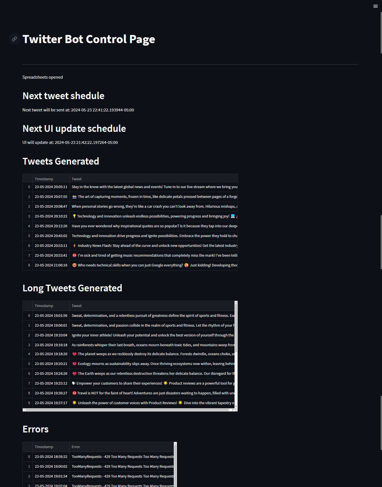
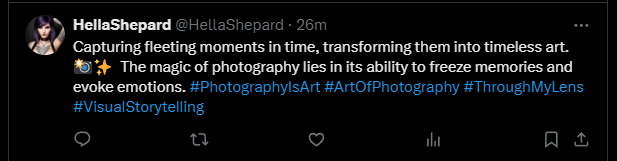
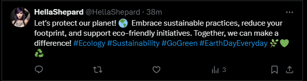

# Twitter Bot Control Page

## Overview
This project is a Twitter bot that generates and posts tweets using the Gemini API. The bot also logs tweets, errors, and tweets that exceed the character limit in a Google Sheets file. The user interface is built with Streamlit, though the project is considering moving to Flask due to UI update issues with the scheduler.

## Features
- **Automated Tweet Generation**: Tweets are created using the Gemini API based on randomly selected themes and emotions.
- **Tweet Posting**: Generated tweets are posted on Twitter using the Tweepy API.
- **Error Handling**: Tweets that exceed 280 characters and errors are logged in a Google Sheets file.
- **User Interface**: Built with Streamlit, displays logs, scheduled tweets, and error information. (Read the limitations section about this feaure)
- **Periodic Updates**: A scheduler periodically generates and posts tweets, and updates the UI.

## Installation

### Prerequisites
- Python 3.7+
- Streamlit
- Tweepy
- Google API Client Library
- APScheduler
- Pandas
- dotenv

### Environment Variables
Create a `.env` file in the root directory and add the following environment variables:

    ```
    CONSUMER_KEY=your_twitter_consumer_key
    CONSUMER_SECRET=your_twitter_consumer_secret
    ACCESS_TOKEN=your_twitter_access_token
    ACCESS_SECRET=your_twitter_access_secret
    GOOGLE_JSON=your_google_service_account_json
    GOOGLE_SHEET=your_google_sheet_url
    GOOGLE_AI_KEY=your_google_ai_key
    ```

### Installation Steps

1. Clone the repository:
    ```sh
    git clone https://github.com/Malegiraldo22/twitterbot.git
    cd twitterbot
    ```

2. Install dependencies:
    ```sh
    pip install -r requirements.txt
    ```

3. Run the Streamlit app:
    ```sh
    streamlit run app.py
    ```

## Usage

### Streamlit Interface
- Open your web browser and go to the local address provided by Streamlit (usually `http://localhost:8501`).
- The main page displays logs, generated tweets, long tweets, and errors.

### Scheduler
- Tweets are generated and posted every hour.
- The UI updates every minute to reflect new data from Google Sheets.

### Customization

- You can customize the list of themes and emotions in the `theme_selection` function to tailor the generated tweets to your preferences or specific use case.

## Code Explanation

### Authentication
- **Twitter Authentication**: Uses Tweepy to authenticate with the Twitter API.
- **Google Sheets Authentication**: Uses `gspread` and `google-auth` to connect to Google Sheets.

### Logging
- Logs are displayed on the Streamlit interface (Read the limitations section to more about this) and stored in Google Sheets.

### Functions
- `theme_selection()`: Randomly selects a theme and emotion for tweet generation.
- `log_to_sheet(sheet, message)`: Logs messages to a specified Google Sheet.
- `create_and_publish_tweet(theme, emotion, max_retries=5)`: Generates and posts a tweet, handling errors and retries.
- `check_sheet_updates()`: Fetches data from Google Sheets.
- `run_periodically()`: Generates and posts tweets periodically.
- `tweet_schedule()`: Schedules the `run_periodically` function to run every hour.
- `refresh_ui()`: Refreshes the Streamlit UI to display updated data.
- `ui_schedule()`: Schedules the `refresh_ui` function to run every minute.

## Limitations

- The quality and coherence of the generated tweets may vary based on the complexity of the selected theme and the capabilities of the language model used.
- The Twitter API has rate limits and other restrictions that may affect the frequency and volume of tweets that can be published.
- Currently, the UI does not update properly when the scheduler runs. Moving to Flask might be a solution to this issue.

## Contributing
Contributions are welcome! Please fork this repository and submit a pull request with your changes.

## Contact
For any questions or comments, please open an issue on GitHub or contact me directly at magiraldo2224@gmail.com

## Application interface


## Example of generated tweets



